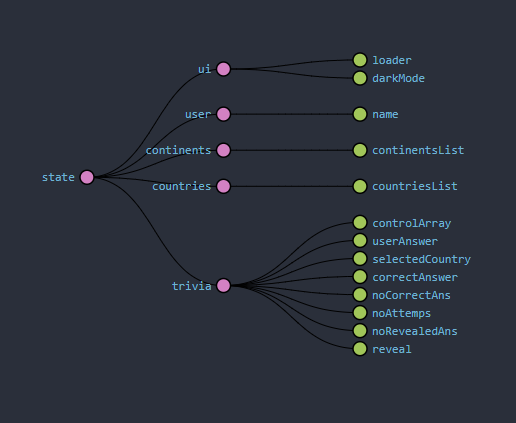
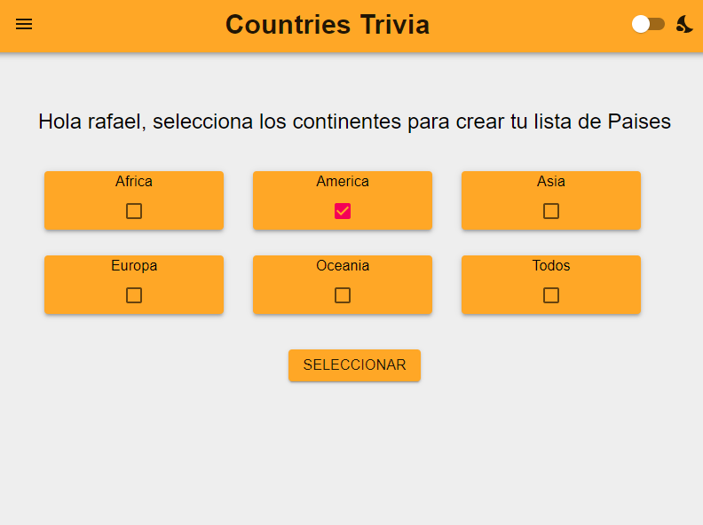
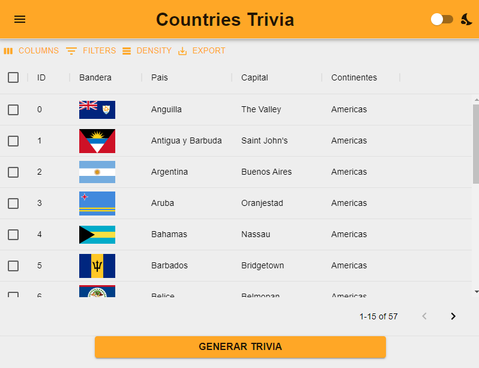
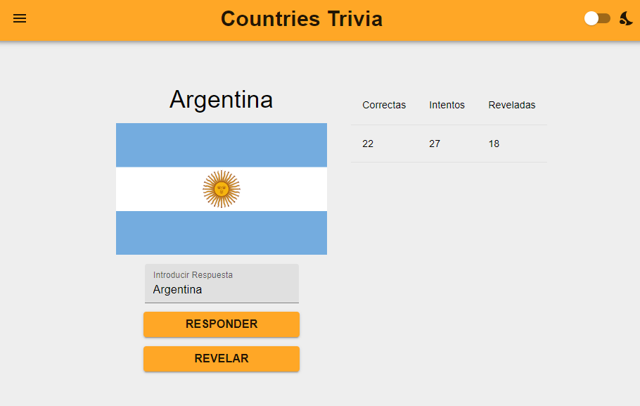
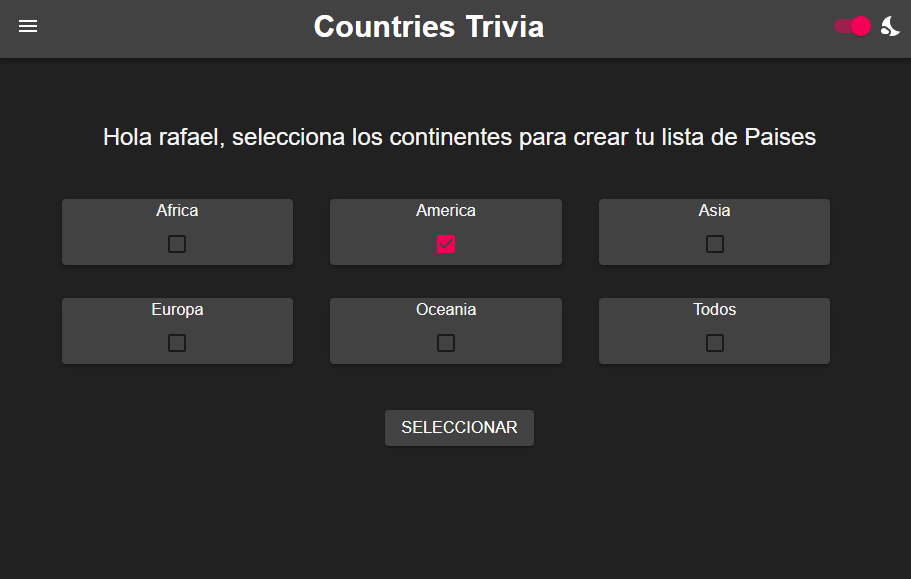

# Countries Trivia
> Una SPA para aprender de Geografia, Nombres de paises y sus banderas.

## Tabla de contenido

- [Motivacion](#motivacion)
- [Descripcion](#descripcion)

## Motivacion
---
<br/>
Cumplir con los requerimientos solicitados por el cliente, diseñando una aplicacion que pueda servir como una herramienta de aprendizaje, y que ofrezca una experiencia interactiva y dinamica.

<br/>
<br/>

## Descripcion
---
<br/>
Es una SPA desarrollada con React, utilizando react-router como libreria de enrotamiento interna.
Permitiendo que el usuario interactue con el estado de la aplicacion emitiendo acciones procesadas por los reducers, utilizando Redux para la infraestructura del Store y React-Redux para sacar provecho del componente proveedor de Contexto.

<br/>

<br/>

### **Estructura de Carpeta**

```js
/src
  /Components /*All React Components, Prototypes Represent a View */
    /Elements
    /Module
    /Prototypes
  /Context /* React components that wraps the app inside providing context */
    ThemeProvider
    RouterProvider
    ReduxProvider
  /Routes /* A Switch component that wraps all routes of the app */
  /Store /*Where the entities or domains Actions and Reducer are declared*/
   /Entity
    entity.actions.js
    entity.reducers.js
    /middlewares
    store.js
  /Test
  /Utils

```

### **Tecnologias implementadas**

- #### *Redux, React-Redux Redux-devtool

Implementadas para interactuar con el estado de la aplicacion, y para procesar las llamadas a la REST API externa, implementando los middlewares para realizar la llamadas usando *FETCH*

```js
const apiMiddleware = ({ dispatch }) => (next) => async (action) => {
  next(action);
  /*Verifica el tipo de accion*/
  if (action.type.match(/API_REQUEST/)) {
    const {
      entity, method, urls, history,
    } = action.payload.meta;
    let allData;
    try {
      /* Notifica a la UI que se esta realizando la llamada*/
      dispatch(setLoader(true));

      /* Ya que puede haber varias llamadas simultanes se hacen de manera 
      concurrente para aumentar la velocidad del proceso*/
      const resF = await Promise.all(urls.map((url) => fetch(url, { method })));
      const dataF = await Promise.all(resF.map((res) => res.json()));

      allData = [].concat(...dataF);

      /*Se notifica al Reducer que ya hubo una respuesta positiva */
      dispatch(apiSuccess(allData, entity));
      history.push('/countriesList');
    } catch (error) {
      /*En caso de haber error se notifica al reducer*/
      dispatch(apiError(error, entity));
    }
  }
  /* Si las acciones intecceptadas por el middleware son respuestas
  se notifica a la UI*/
  if (action.type.match(/API_ERROR/) || action.type.match(/API_SUCCESS/)) {
    dispatch(setLoader(false));
  }
};

```

Este middleware es flexible por lo que puede procesar cualquier llamada, notificando el tipo de entidad para la cual esta siendo realizada, e interactuando con la UI, para mostrar cualquier ouput o loader.

- #### *Estructura del Estado de La Aplicacion*

<br/>

  

- ### *Git-hooks, Husky and Lint staged*
  Implementados para resguardar la integridad del codigo que va a ser incorporado al Repositorio. Ademas se implemento GitFlow, usando el Master branch para Releases,  un branch de desarrollo al cual se incorporaban los branches que agregaban funcionabilidad.
---
 ### **Views, e interaccion del usuario**
<br/>

- El usuario al ingresar a la app, puede introducir su nombre y direactamente guardar esa info en la app, usando el Store de Redux  que a su vez lo guarda en el local store del Browser.

<br/>


- El usuario seleccionara los continentes de los cual desea aprender el nombre y bandera de los paises, al darle al boton de seleccionar se Realizara una matriz de llamadas a la REST API con las url respectivas a cada continent, y selecciona todos los continentes llamara a otro end-point que devuelve todos los paises.



- El usuario podra visualizar una lista de todos los paises pertenecientes a los continentes seleccionados, y asi aprenderce todos los Nombres y banderas.


- El usuario podra participar en una trivia interactiva la cual de manera aleatoria seleccionara una pais de la lista y mostrara su bandera y el usuario podra introdcir su nombre, ademas mostrara un dashboard con el puntaje y el numero de intentos ademas del numero de veces que el usuario alla pedido ayuda.


- El usuario podra seleccionar un modo nocturno para la UI.



## Instrucciones de Instalacion

- Installar de manera local el repositorio 

```git
git clone https://github.com/recalderon93/react-pre-interview-app.git
```

- Ingresar a la carpeta Raiz e instalar las dependencias

```npm
npm install
```
- Ademas puedes crear un Dev server, construir la app o correr los test, y modificando el package.json puedes hacer el deploy a tus github pages.


```npm

npm start
npm run build
npm test
npm run deploy

```
- Ademas si deseas puede correr la aplicacion en un contenedor docker.

```docker
docker build . -t react-test  

docker run -p3000:3000 -d react-test 
```
---

## Licencia


MIT License

Copyright (c) [2017] [James Q Quick]

Permission is hereby granted, free of charge, to any person obtaining a copy
of this software and associated documentation files (the "Software"), to deal
in the Software without restriction, including without limitation the rights
to use, copy, modify, merge, publish, distribute, sublicense, and/or sell
copies of the Software, and to permit persons to whom the Software is
furnished to do so, subject to the following conditions:

The above copyright notice and this permission notice shall be included in all
copies or substantial portions of the Software.

THE SOFTWARE IS PROVIDED "AS IS", WITHOUT WARRANTY OF ANY KIND, EXPRESS OR
IMPLIED, INCLUDING BUT NOT LIMITED TO THE WARRANTIES OF MERCHANTABILITY,
FITNESS FOR A PARTICULAR PURPOSE AND NONINFRINGEMENT. IN NO EVENT SHALL THE
AUTHORS OR COPYRIGHT HOLDERS BE LIABLE FOR ANY CLAIM, DAMAGES OR OTHER
LIABILITY, WHETHER IN AN ACTION OF CONTRACT, TORT OR OTHERWISE, ARISING FROM,
OUT OF OR IN CONNECTION WITH THE SOFTWARE OR THE USE OR OTHER DEALINGS IN THE
SOFTWARE.


---

## Informacion del Autor

- Twitter - [@recalderon93](https://twitter.com/recalderon93)
- Linkedin -[@recalderon93](https://www.linkedin.com/in/recalderon93/)

